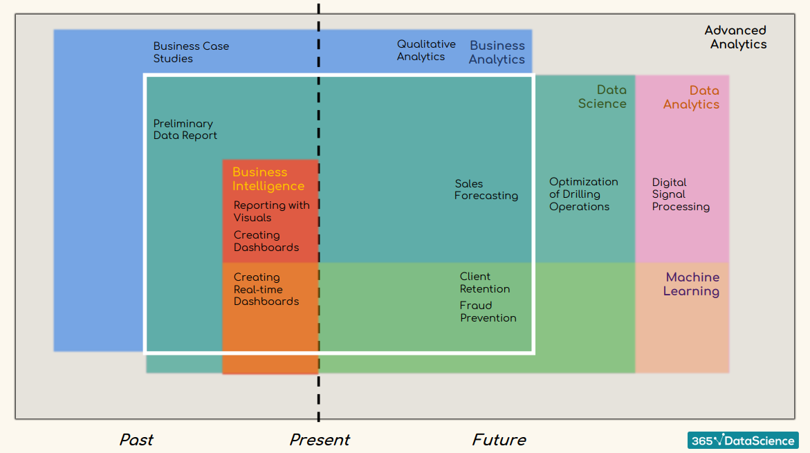

# Introduction to Data Science

## Table of content

- [Introduction to Data Science](#introduction-to-data-science)
  - [Table of content](#table-of-content)
  - [Analysis vs Analytics](#analysis-vs-analytics)
    - [Example](#example)
  - [Business Intelligence](#business-intelligence)
  - [Machine Learning](#machine-learning)
  - [Observation](#observation)
  - [Quantification](#quantification)
  - [Measure](#measure)
  - [Metric](#metric)
  - [KPI (key performance indicator)](#kpi-key-performance-indicator)
  - [Infographic](#infographic)

## Analysis vs Analytics

Analysis involves examining something that has already happened, often for the purpose of understanding how and why it occurred. Qualitative analysis relies on subjective methods (those that rely on personal interpretation and judgment, rather than objective data or measurements.) such as observation and expert judgment to analyze data, while quantitative analysis uses statistical and mathematical methods to analyze numerical data.

Analytics involves using data from analysis to make predictions about the future. This can involve both qualitative and quantitative methods. However, it's worth noting that the distinction between analysis and analytics can be somewhat fluid and the terms are sometimes used interchangeably.

While intuition and expert judgment can play a role in qualitative analysis, prediction often relies on more than just intuition. Similarly, while quantitative analytics may involve using formulas and algorithms, it can also involve more subjective decisions such as choosing the appropriate model or interpreting the results.

### Example

In the business world, analysis is often used to evaluate past performance and identify areas for improvement. For example, a company might analyze sales data to determine which products are selling well and which ones are not. Analytics can then be used to predict future sales trends and inform decisions about product development, marketing, and inventory management.

## Business Intelligence

Business Intelligence is the process of analyzing and reporting historical business data.

## Machine Learning

Machine Learning is the ability of machines to predict outcomes without being explicitly programmed.

## Observation

In business intelligence, an observation refers to a single piece of data or a single instance of an event that is being analyzed.

## Quantification

Quantification is the process of representing observations as numbers.

## Measure

A measure is the accumulation of observations to show some information.

## Metric

metric = measure + business meaning.

## KPI (key performance indicator)

KPI = metric + business objective.

## Infographic

