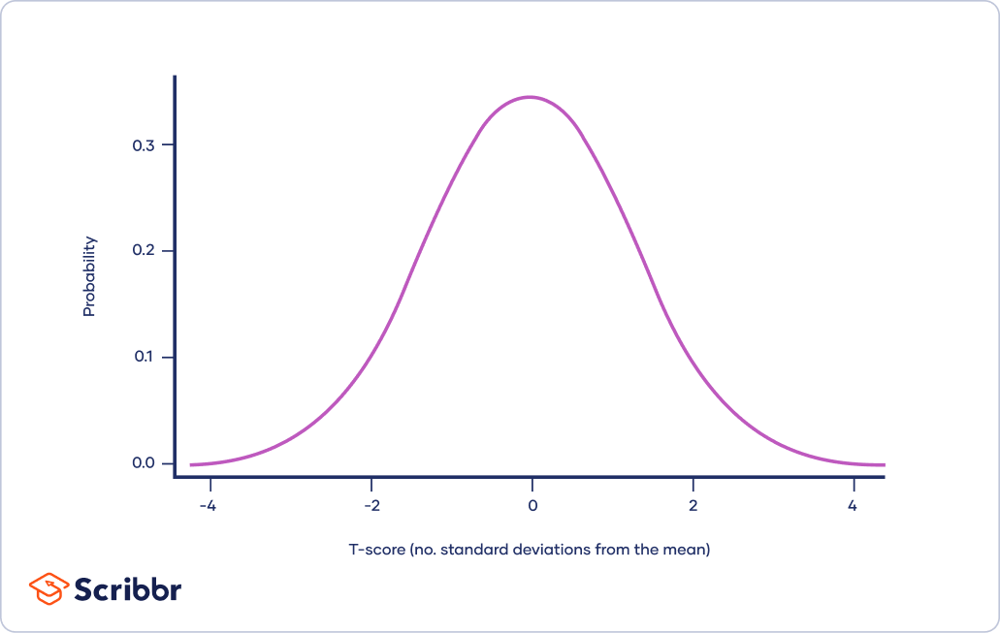
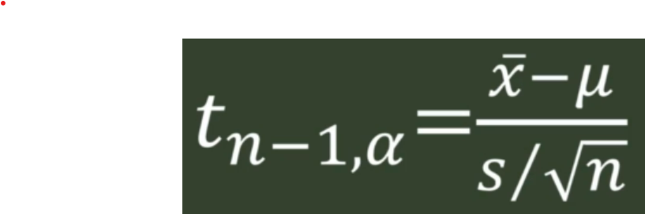

# Inferential Statistics

## Table of contents

- [Inferential Statistics](#inferential-statistics)
  - [Table of contents](#table-of-contents)
  - [Normal Distribution](#normal-distribution)
  - [Standard Normal Distribution](#standard-normal-distribution)
  - [Central Limit Theorem](#central-limit-theorem)
  - [Standard Error](#standard-error)
  - [Point Estimates and Confidence Intervals](#point-estimates-and-confidence-intervals)
  - [Confidence Level](#confidence-level)
  - [Z-Critical Value](#z-critical-value)
  - [T-Distribution](#t-distribution)
  - [Standard T-Distribution](#standard-t-distribution)
  - [Degrees of Freedom](#degrees-of-freedom)
  - [T-Critical Value](#t-critical-value)
  - [Margin of Error](#margin-of-error)
  - [Confidence Interval for Two Dependent Mean Differences](#confidence-interval-for-two-dependent-mean-differences)
  - [Confidence Interval for Two Independent Mean Differences (Variance Known)](#confidence-interval-for-two-independent-mean-differences-variance-known)
  - [Confidence Interval for Two Independent Mean Differences (Variance Unknown)](#confidence-interval-for-two-independent-mean-differences-variance-unknown)

Okay, here is the original markdown with some improvements:

## Normal Distribution

The normal distribution is a continuous probability distribution that is symmetrical about the mean, showing that data near the mean are more frequent in occurrence than data far from the mean.

## Standard Normal Distribution

The standard normal distribution is a normal distribution with a mean of 0 and standard deviation of 1. It allows easy comparison of normal distributions with different means and standard deviations.

## Central Limit Theorem

The central limit theorem states that as sample size increases, the sampling distribution of the sample mean approaches a normal distribution, regardless of the shape of the population distribution. This allows the normal distribution to be used in statistics for inference.

## Standard Error

The standard error is a measure of how much sample statistics, such as the sample mean, are expected to differ from the true population parameter. It decreases as sample size increases.

## Point Estimates and Confidence Intervals

A point estimate provides a single value as an estimate of a population parameter. A confidence interval gives a range of likely values for the parameter. The confidence level indicates the probability that the interval contains the true parameter value.

## Confidence Level

The confidence level indicates how sure we can be that the confidence interval contains the true population parameter. Common levels are 90%, 95%, and 99%.

## Z-Critical Value

The z-critical value is the z-score boundary for a given significance level in a normal distribution. It is used to construct confidence intervals when the population standard deviation is known.

## T-Distribution

The t-distribution is used for inference when the sample size is small and population standard deviation is unknown. It has thicker tails than the normal distribution.

## Standard T-Distribution

The standard t-distribution has a mean of 0 and degrees of freedom (df) of 1. It is used to find t-critical values.

## Degrees of Freedom

Degrees of freedom relate to the amount of information in the sample.

## T-Critical Value

The t-critical value allows construction of a confidence interval when the population standard deviation is unknown. It depends on the significance level and degrees of freedom.

## Margin of Error

The margin of error indicates the max distance between the sample statistic and population parameter. It depends on confidence level and sample size.

## Confidence Interval for Two Dependent Mean Differences

Calculates a confidence interval for the difference between two means in a paired/dependent sample.

## Confidence Interval for Two Independent Mean Differences (Variance Known)

Calculates a confidence interval for the difference between two means in an independent sample where the population variances are known.

## Confidence Interval for Two Independent Mean Differences (Variance Unknown)

Calculates a confidence interval for the difference between two means in an independent sample where the population variances are unknown. Uses a pooled variance estimate.

Let me know if you would like me to clarify or expand on any part of the inferential statistics overview.
