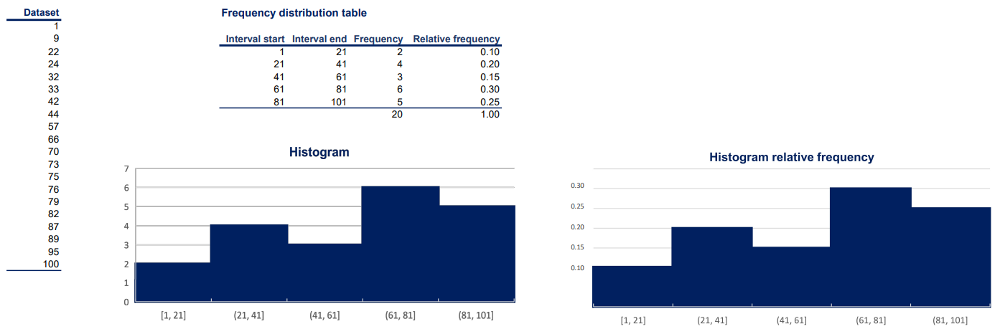

# Statistics

## Table of Contents

- [Statistics](#statistics)
  - [Table of Contents](#table-of-contents)
  - [Population (N)](#population-n)
  - [Sample (n)](#sample-n)
  - [Data Types](#data-types)
    - [Categorical Data](#categorical-data)
    - [Numerical Data](#numerical-data)
      - [Discrete Data](#discrete-data)
      - [Continuous Data](#continuous-data)
  - [Data Measurements](#data-measurements)
    - [Qualitative Data](#qualitative-data)
      - [Nominal Data](#nominal-data)
      - [Ordinal Data](#ordinal-data)
    - [Quantitative Data](#quantitative-data)
      - [Interval Data](#interval-data)
      - [Ratio Data](#ratio-data)
  - [Visualization techniques](#visualization-techniques)
    - [Categorical variables](#categorical-variables)
      - [Frequency distribution table (Categorical variables)](#frequency-distribution-table-categorical-variables)
      - [Bar chart](#bar-chart)
      - [Pie chart](#pie-chart)
      - [Pareto diagram](#pareto-diagram)
    - [Numerical variables](#numerical-variables)
      - [Frequency distribution table (Numerical variables)](#frequency-distribution-table-numerical-variables)
      - [Histogram](#histogram)
    - [Two variables Visualization techniques](#two-variables-visualization-techniques)
      - [Cross table](#cross-table)
      - [Scatter plot](#scatter-plot)

## Population (N)

In statistics, a population is the entire group of individuals, objects, or measurements that we are interested in studying. The numbers obtained from analyzing a population are called parameters.

## Sample (n)

A sample is a smaller group of individuals, objects, or measurements that we select from the population to represent it. The numbers obtained from analyzing a sample are called statistics. Statistics are used to estimate parameters for the population.

## Data Types

Data can be classified into two main types:

### Categorical Data

Categorical data describes categories or groups that have no inherent order or numerical significance.

### Numerical Data

Numerical data describes numbers and can be further classified into two types:

#### Discrete Data

Discrete data consists of whole numbers or integers and can be counted in a finite manner.

#### Continuous Data

Continuous data consists of real numbers and is infinite and impossible to count.

## Data Measurements

Measurements can be classified into two levels:

### Qualitative Data

Qualitative data refers to non-numeric data and can be further classified into two types:

#### Nominal Data

Nominal data consists of categories or groups that have no inherent order or numerical significance.

#### Ordinal Data

Ordinal data consists of categories or groups that have a natural order or ranking.

### Quantitative Data

Quantitative data refers to numeric data and can be further classified into two types:

#### Interval Data

Interval data consists of numeric values that have equal intervals between them but do not have a true zero point.

#### Ratio Data

Ratio data consists of numeric values that have equal intervals between them and a true zero point, meaning that ratios of the values are meaningful.

## Visualization techniques

### Categorical variables

#### Frequency distribution table (Categorical variables)

#### Bar chart

#### Pie chart

#### Pareto diagram

### Numerical variables

#### Frequency distribution table (Numerical variables)

#### Histogram

### Two variables Visualization techniques

#### Cross table

#### Scatter plot

