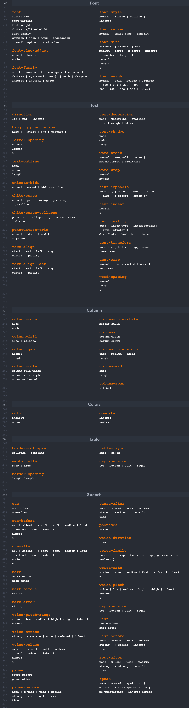

# CSS3

CSS3 is a language that allows web developers to control the design and layout of their web pages. It's like a set of instructions that tells your web browser how to display the content on a webpage.

## Cheat sheet

### [CSS3 cheat sheet PDF Document](wsu-css-cheat-sheet-gdocs.pdf)

### [Tailwind CSS Documentation](https://tailwindcss.com/)
