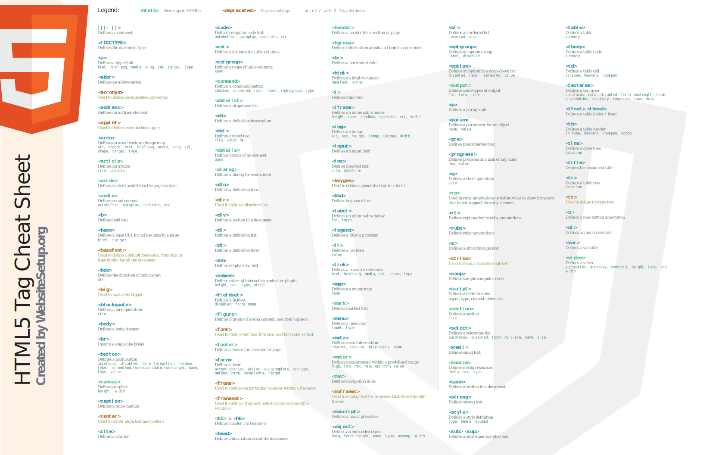

# HTML5

HTML5 (Hypertext Markup Language, version 5) is the latest version of the markup language used to create and structure content on the web.

## Cheat sheet

### [PDF document](html5-tag-cheat-sheet-2019.pdf)
