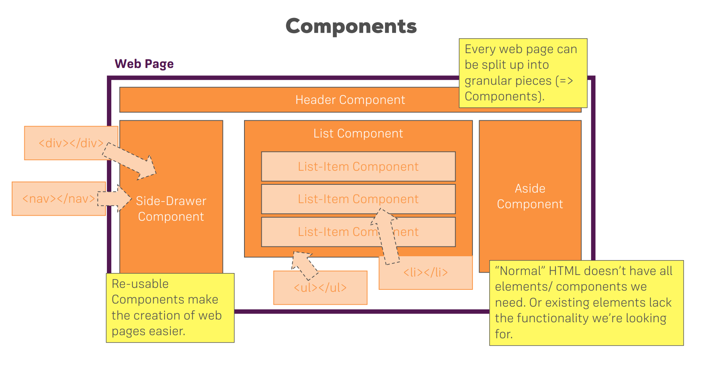

# React

ReactJS is a JavaScript library for building user interfaces. It's used to create interactive and dynamic web applications by breaking the UI into reusable components.

## Components

ReactJS follows a component-based architecture, where the UI is divided into reusable components. Components are independent and self-contained pieces of the user interface that can be composed together to build complex UI structures.

